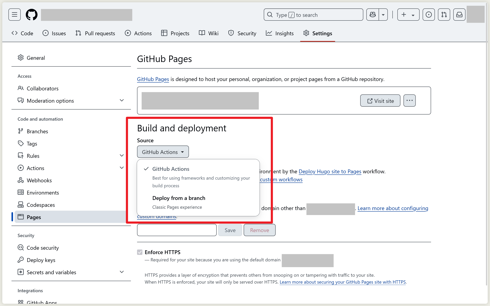

当我部署网站到 Github Pages 时发现在 Actions 中多了一个 pages-build-deployment 进程，这是 Github Pages 默认提供的针对 Jekyll 生成器的部署 Actions。使用 Hugo 等生成器，需要在仓库的  Settings - Pages - Build and deployment - Source 从 Deploy from a brach 切换到 Github Actions 以关闭 pages-build-deployment 进程。

引用

[Stack Overflow | GitHub actions: going through with pages-build-deployment](https://stackoverflow.com/questions/70631168/github-actions-going-through-with-pages-build-deployment)
